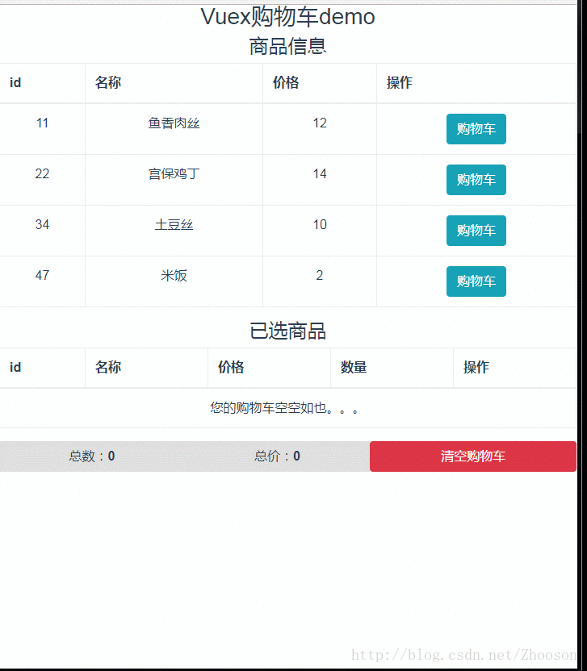

### vuex-cart

> 用vuex实现简单的购物车Demo
大致效果如下：

#### Build Setup

``` bash
# install dependencies
npm install

# serve with hot reload at localhost:8080
npm run dev

# build for production with minification
npm run build
```
参考链接：(http://blog.csdn.net/Zhooson/article/details/78495250)

